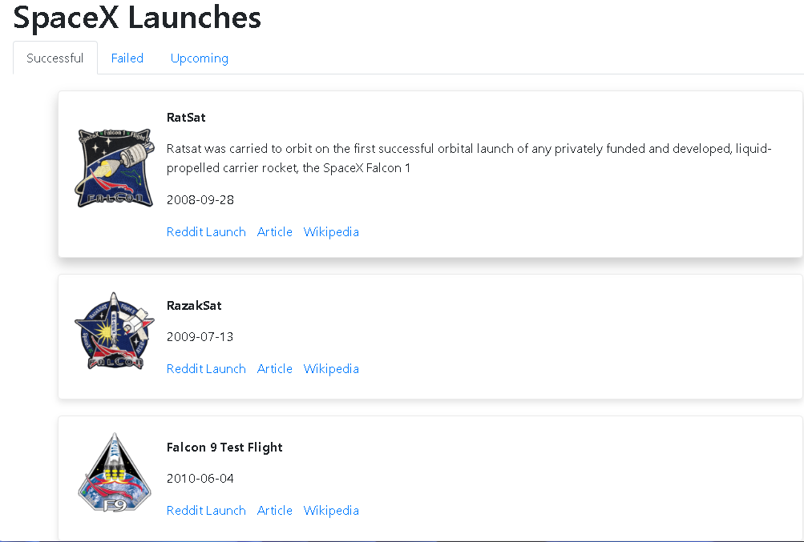
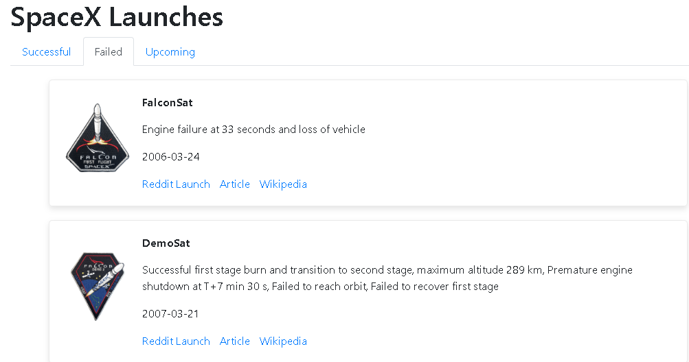

# SpaceX Launch Information App
 
## Overview

This Python application provides information about SpaceX launches, including details on successful, failed, and upcoming launches of their spacecraft and rockets. It utilizes the SpaceX API to fetch and display this data in a user-friendly manner.

## Table of Contents

- [Installation](#installation)
- [Usage](#usage)
- [Features](#features)
- [Screenshots](#screenshots)
- [Contributing](#contributing)
- [License](#license)

## Installation

1. Clone the repository to your local machine:

   ```bash
   git clone https://github.com/achkatam/SpaceX-Launches.git
Navigate to the project directory:

bash
Copy code
    cd SpaceX-Launch-Info-App 
 
bash
Copy code
python app.py

## Usage
Once you've installed and launched the application, you can use it to access SpaceX launch information:

View successful launches.
View failed launches.
Check the details of upcoming launches.
Explore additional information about each launch.
## Features
List of Successful Launches: Access a list of all SpaceX successful launches.

List of Failed Launches: Access a list of all SpaceX failed launches.

Upcoming Launches: Check details about upcoming SpaceX launches.

Detailed Launch Information: Retrieve additional information about each launch, including the launch date, mission name, rocket name, launch site, and more.

## Screenshots

### Successful launches


### Failed launches



# Contributing
Contributions are welcome! If you'd like to contribute to this project, please follow these steps:

## Fork the repository.
Create a new branch for your feature: git checkout -b feature-name
Implement your feature or bug fix.
Commit your changes: git commit -m "Add feature or fix"
Push to your branch: git push origin feature-name
Create a Pull Request (PR) with a clear description of your changes.
License
This project is licensed under the MIT License - see the LICENSE file for details.